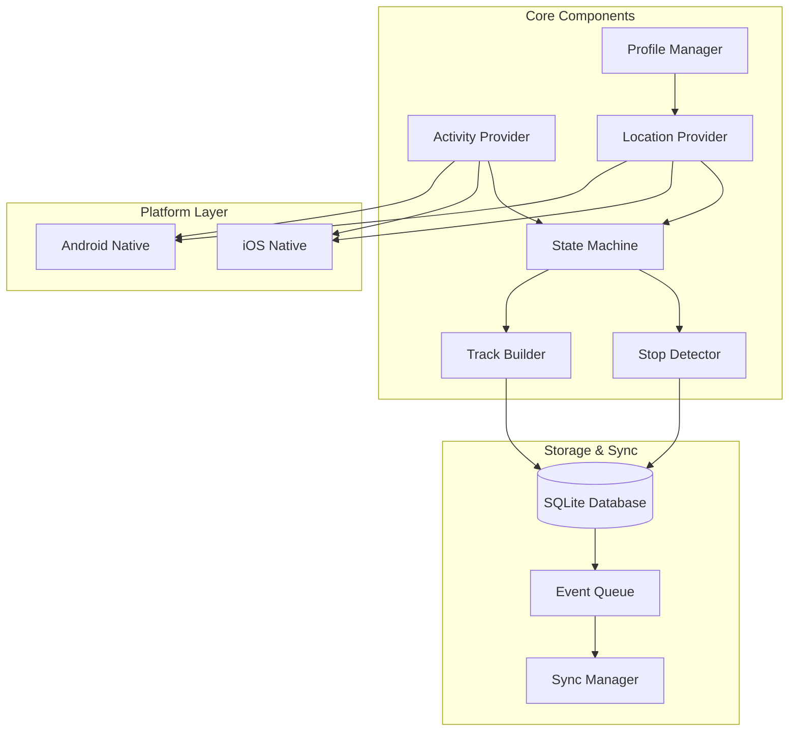

# План реализации: Motion-aware геотрекинг система

## Обзор проекта

Реализация подсистемы motion-aware геотрекинга для iOS/Android с детекцией остановок, сегментацией движения, near-realtime обновлениями и оптимизацией батареи. Система будет работать как фоновый сервис с UI для управления.

## Статус реализации

| Задача | Описание | Статус |
|--------|----------|--------|
| **Зависимости** | Добавить зависимости в pubspec.yaml: sqflite, permission_handler, workmanager, flutter_background_service, activity_recognition, flutter_local_notifications | ✅ Завершено |
| **База данных** | Создать tracking_database.dart с SQLite схемой: segments, location_points, events, current_state таблицы | ✅ Завершено |
| **Модели** | Создать модели: ActivityState enum, LocationFix, Segment, TrackingEvent | ✅ Завершено |
| **Activity Provider** | Реализовать ActivityProvider с интеграцией iOS Core Motion и Android Activity Recognition | ✅ Завершено |
| **Location Provider** | Реализовать LocationProvider с тремя профилями (Active Movement, Stop Acquisition, Idle) и переключением режимов | ✅ Завершено |
| **State Machine** | Реализовать StateMachine с логикой стабилизации (20-40 сек), анти-флаппингом и обработкой переходов | ✅ Завершено |
| **Stop Detector** | Реализовать StopDetector с Stop Acquisition Window, вычислением anchor (медиана/взвешенное среднее) и правилами подтверждения | ✅ Завершено |
| **Track Builder** | Реализовать TrackBuilder с правилами добавления точек (дистанция/курс/время) и упрощением полилиний (Douglas-Peucker) | ✅ Завершено |
| **Profile Manager** | Реализовать ProfileManager для переключения GPS профилей на основе состояния и батареи | ✅ Завершено |
| **Battery Manager** | Реализовать BatteryManager для мониторинга батареи, low power mode и деградации режимов | ✅ Завершено |
| **Tracking Service** | Реализовать TrackingService как главный оркестратор с lifecycle управлением и интеграцией фонового сервиса | ✅ Завершено |
| **Event Queue** | Реализовать EventQueue для локального хранения событий с client_event_id и retry логикой | ✅ Завершено |
| **iOS конфигурация** | Настроить iOS: добавить NSLocationAlwaysAndWhenInUseUsageDescription, background modes в Info.plist | ✅ Завершено |
| **Android конфигурация** | Настроить Android: добавить разрешения (ACCESS_BACKGROUND_LOCATION, ACTIVITY_RECOGNITION), foreground service в AndroidManifest.xml | ✅ Завершено |
| **UI: Настройки** | Создать TrackingSettingsScreen с переключателем трекинга, настройками точности, просмотром истории | ✅ Завершено |
| **UI: Статус** | Создать TrackingStatusWidget для отображения текущего состояния и координат | ✅ Завершено |
| **Sync Manager** | Создать заглушку SyncManager с форматом payload для будущей интеграции с сервером | ✅ Завершено |

## Архитектура

Система состоит из следующих компонентов:



## Зависимости

Добавить в `pubspec.yaml`:

- `sqflite: ^2.3.0` - локальная БД
- `permission_handler: ^11.0.0` - управление разрешениями
- `workmanager: ^0.5.2` - фоновые задачи (Android)
- `flutter_background_service: ^5.0.0` - фоновый сервис
- `flutter_background_service_android: ^5.0.0` - Android специфичный
- `flutter_background_service_ios: ^5.0.0` - iOS специфичный
- `activity_recognition: ^2.0.0` или `pedometer: ^4.0.0` - распознавание активности (альтернатива)
- `flutter_local_notifications: ^16.0.0` - уведомления для foreground service

## Структура файлов

```javascript
lib/
  tracking/
    core/
      activity_provider.dart          # Activity Provider (iOS/Android)
      location_provider.dart          # Location Provider с профилями
      state_machine.dart              # Машина состояний
      stop_detector.dart              # Детектор остановок
      track_builder.dart              # Построитель треков + упрощение
      profile_manager.dart            # Переключение профилей GPS
      battery_manager.dart            # Менеджер батареи/политик
    storage/
      tracking_database.dart          # SQLite схема и DAO
      event_queue.dart                # Очередь событий для синка
    sync/
      sync_manager.dart               # Менеджер синхронизации (заглушка)
    models/
      activity_state.dart             # Enum: STILL, WALKING, IN_VEHICLE
      location_fix.dart               # Модель точки локации
      segment.dart                    # Модель сегмента (movement/stop)
      tracking_event.dart             # События системы
    service/
      tracking_service.dart           # Главный сервис (Lifecycle)
    ui/
      tracking_settings_screen.dart  # Настройки трекинга
      tracking_status_widget.dart     # Виджет статуса
```

## База данных (SQLite)

### Таблицы

1. **segments** - Завершенные сегменты движения/остановок

- `id`, `type` (movement/stop), `state` (STILL/WALKING/IN_VEHICLE)
- `t_start`, `t_end`, `t_confirm` (для stop)
- `anchor_lat`, `anchor_lon`, `anchor_accuracy` (для stop)
- `polyline` (JSON для movement), `stats` (JSON)
- `confidence`, `synced` (bool)

2. **location_points** - Точки в текущем активном сегменте

- `id`, `segment_id` (nullable для текущего), `lat`, `lon`
- `accuracy`, `speed`, `heading`, `provider`, `timestamp`
- `accepted` (bool - принята ли в сегмент)

3. **events** - Очередь событий для синка

- `id`, `client_event_id`, `type`, `payload` (JSON)
- `created_at`, `synced_at`, `retry_count`

4. **current_state** - Текущее состояние (singleton)

- `state`, `last_location_lat`, `last_location_lon`
- `last_update`, `confidence`

## Реализация компонентов

### 1. Activity Provider (`activity_provider.dart`)

**iOS**: Использовать `CMMotionActivityManager` через platform channels или пакет `pedometer`.

**Android**: `ActivityRecognition` API через `activity_recognition` пакет.

Интерфейс:

```dart
abstract class ActivityProvider {
  Stream<ActivityState> get activityStream;
  Future<void> start();
  Future<void> stop();
}
```

### 2. Location Provider (`location_provider.dart`)

Использовать `geolocator` с переключением профилей:

- **Profile A (Active Movement)**: `LocationAccuracy.high` / `balanced`, интервал 10-20 сек или по дистанции
- **Profile B (Stop Acquisition)**: `LocationAccuracy.high`, короткое окно 15-25 сек
- **Profile C (Idle)**: `LocationAccuracy.low` или `LocationSettings.distanceFilter`, редкие обновления

Реализовать `LocationProfile` enum и метод `switchProfile(LocationProfile)`.

### 3. State Machine (`state_machine.dart`)

Входы: `ActivityState` + `LocationFix` + `Speed`

Выходы: стабилизированное состояние + события переходов

Правила стабилизации:

- Состояние принимается после 20-40 сек удержания ИЛИ явного transition с высокой уверенностью
- Анти-флаппинг: гистерезис по скорости/радиусу

### 4. Stop Detector (`stop_detector.dart`)

Логика:

- При переходе в `STILL` запускается Stop Acquisition Window (15-25 сек)
- Собираются N точек (3-8), фильтруются выбросы
- Anchor = медиана или взвешенное среднее (вес = 1/accuracy²)
- Подтверждение остановки: `STILL` + внутри радиуса 30-50м + длительность >= 2 мин
- Для `IN_VEHICLE`: дополнительная проверка на пробки (3-5 мин + motion state)

### 5. Track Builder (`track_builder.dart`)

Правила добавления точек:

- Дистанция > порога (walking: 30-80м, vehicle: 150-300м)
- Изменение курса > 25-35 градусов
- Fallback: время T секунд при движении

Упрощение полилиний: алгоритм Douglas-Peucker

- Walking: допуск 10-20м
- Vehicle: допуск 20-40м

### 6. Profile Manager (`profile_manager.dart`)

Управляет переключением между профилями GPS на основе:

- Текущего состояния (STILL/WALKING/IN_VEHICLE)
- Уровня батареи
- Системных ограничений (low power mode)

### 7. Battery Manager (`battery_manager.dart`)

Мониторинг:

- Уровень батареи
- Low power mode (iOS/Android)
- Перегрев устройства
- Деградация режимов при проблемах

## Платформенные конфигурации

### iOS (`ios/Runner/Info.plist`)

Добавить:

- `NSLocationAlwaysAndWhenInUseUsageDescription`
- `NSLocationAlwaysUsageDescription`
- Background modes: `location`

### Android (`android/app/src/main/AndroidManifest.xml`)

Добавить разрешения:

- `ACCESS_BACKGROUND_LOCATION` (Android 10+)
- `ACTIVITY_RECOGNITION`
- `FOREGROUND_SERVICE` + `FOREGROUND_SERVICE_LOCATION`

Настроить foreground service для активного трекинга.

## UI компоненты

### Tracking Settings Screen

- Переключатель трекинга (вкл/выкл)
- Уровень точности (20-30м vs экономный)
- Просмотр истории сегментов
- Удаление истории
- Статус синхронизации

### Tracking Status Widget

- Текущее состояние (STILL/WALKING/IN_VEHICLE)
- Последняя координата
- Индикатор фоновой работы
- Батарея/качество сигнала

## Фоновый сервис

### Tracking Service (`tracking_service.dart`)

Главный оркестратор:

- Инициализация всех провайдеров
- Подписка на стримы
- Управление lifecycle
- Обработка разрешений
- Интеграция с `flutter_background_service`

## Этапы реализации

### Этап 1: MVP (Core)

1. База данных и модели
2. Activity Provider (базовая интеграция)
3. Location Provider с профилями
4. State Machine (базовая логика)
5. Stop Detector (базовая логика)
6. Track Builder (без упрощения)
7. Tracking Service (базовая интеграция)

### Этап 2: Оптимизация

1. Упрощение полилиний (Douglas-Peucker)
2. Улучшение правил для пробок
3. Battery Manager
4. Profile Manager (полная логика)
5. Event Queue и локальное хранение

### Этап 3: UI и интеграция

1. Tracking Settings Screen
2. Tracking Status Widget
3. Интеграция в главный экран
4. Foreground service notification (Android)

### Этап 4: Синхронизация (заглушка)

1. Sync Manager (структура)
2. Формат payload для сервера
3. Ретрай логика
4. Идемпотентность

## Метрики и тестирование

Добавить логирование для:

- Задержек обновления статуса
- Точности anchor остановок
- Расхода батареи
- Количества точек в сегментах

Создать тестовые сценарии:
